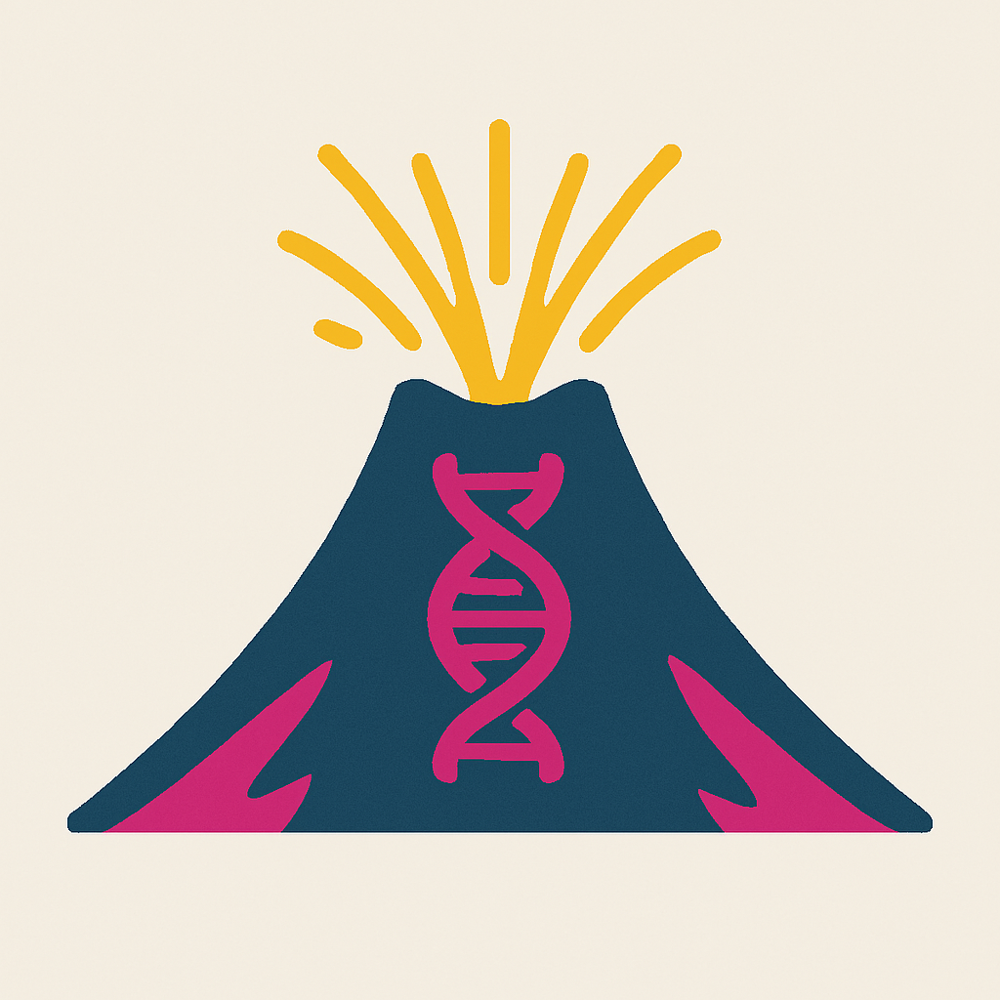
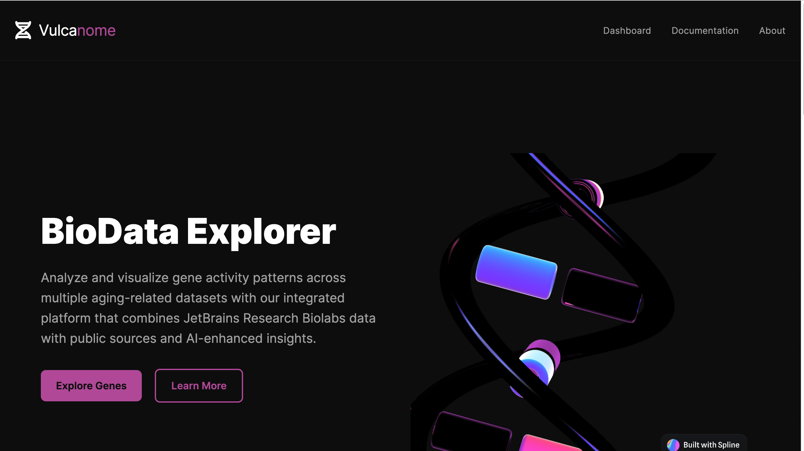
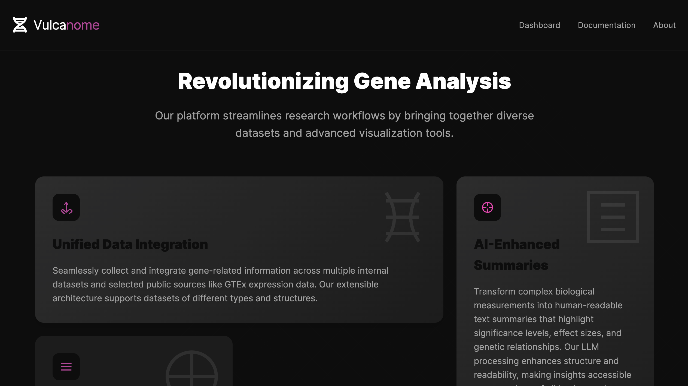
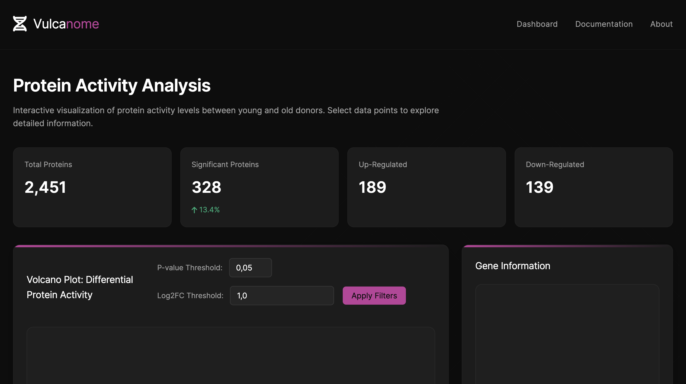
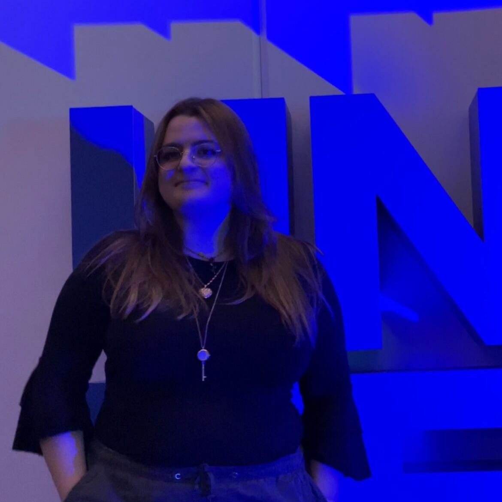
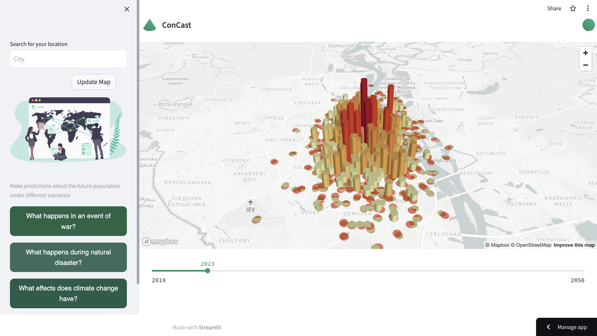
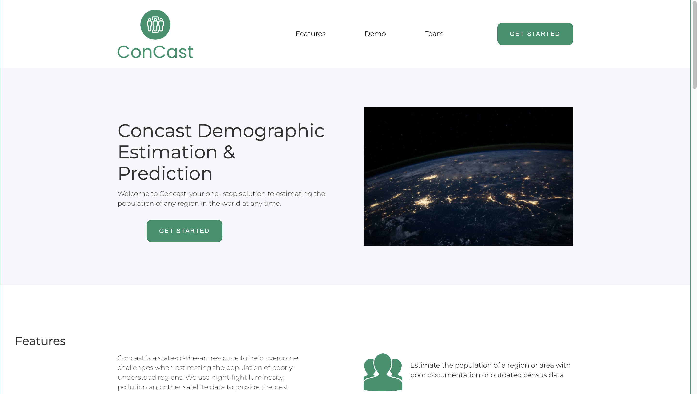
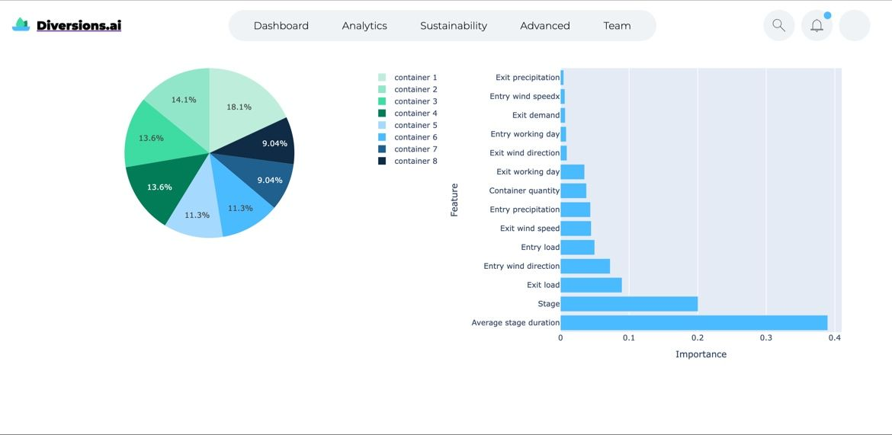
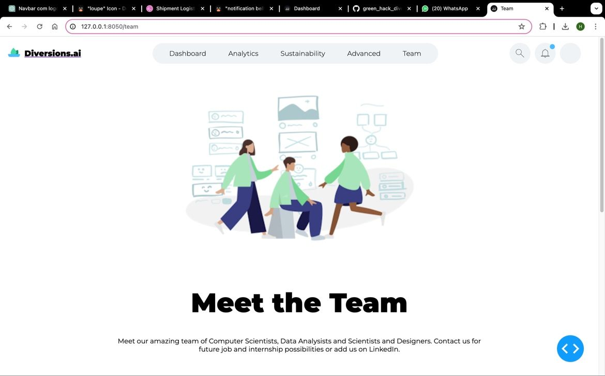

# Vulcanome
 <br/>




Fueling research with dynamic, interactive insights into protein activity.

This project is a Flask-based web service developed as part of my application for the **JetBrains Software Engineering Internship**. It allows users to explore and visualize differences in protein expression levels through an intuitive, interactive interface designed for researchers.

- 🔍 [Learn more about the project](https://heidi-albarazi.vercel.app/jetbrains-internship/gene-knowledge-base-web-service)
- 📄 [View my application and CV](https://heidi-albarazi.vercel.app/)


<p align="left">
  
  
  
  
  
</p>

---
## 📚 Table of Contents

- [🚀 Project Overview](#-project-overview)
- [📌 Project Tasks](#-project-tasks)
- [📁 Project Structure](#-project-structure)
- [🧑‍💻 Getting Started](#-getting-started)
- [🌐 Endpoint](#-endpoint)
- [✨ Author](#-author)

---
## 📌 Project Tasks

This project was developed as part of the JetBrains Software Engineering Internship application challenge. The goal is to build a web service for visualizing protein activity levels interactively.

### 🛠️ Core Tasks

- Build a web service using **Flask**.
- Create an **interactive volcano plot** using data from the “S4B limma results” sheet of `NIHMS1635539-supplement-1635539_Sup_tab_4.xlsx`:
  - Use `adj.P.Val` as the significance metric.
  - Use `EntrezGeneSymbol` as the gene name label.
- Make volcano plot points **clickable**:
  - Clicking a point opens a **boxplot** comparing protein concentrations in **Young vs. Old** donors.
  - Data is based on the “S4A values” sheet of the same file.
  - Donor columns start from `Set002.H4.OD12.dup`.
  - Donor age group is encoded in column names:
    - `OD` = elderly donors
    - `YD` = young donors

### 🌟 Bonus Feature (Implemented)

- Enhance functionality by showing related **scientific paper titles and PubMed links** where the selected gene is mentioned.
- Data is fetched using [MyGene.info](https://mygene.info/) REST API:
  - Example:  
    - `https://mygene.info/v3/query?q=symbol:cdk2` to find a gene ID  
    - `https://mygene.info/v3/gene/1017` to retrieve full gene data, including PubMed papers


### 📋 Requirements

- ✅ Use **Python** and **Flask** for the web service
- ✅ Use any suitable plotting library (e.g. `Plotly`, `Matplotlib`, or `Bokeh`)
- ✅ Use **Git** for version control — with clear, progressive commits
- ✅ Include a well-structured `README.md` with:
  - Setup instructions
  - Configuration info
  - Instructions to run locally

--- 
## 🚀 Project Overview

This repository includes:

- 📦 Flask project boilerplate  
- 📂 Structured folders for templates and static files  
- 🧪 A simple `Hello, World!` endpoint to verify the setup  
- 🛠 Python and PyCharm development environment support  

---

## 📁 Project Structure
```
vulcanome/
├── app/ 
│   ├── data/                       # Contains the NIHMS Excel data file
│   ├── static/
│   │   ├── css/                    # Contains the CSS files
│   │   │   └── styles.css
│   │   ├── js/                     # Contains the JS files
│   ├── templates/                  # Contains the HTML templates
│   │   ├── 404.html
│   │   ├── about.html
│   │   ├── dashboard.html
│   │   ├── documentation.html
│   │   └── index.html
│   ├── routes.py
│   ├── __init__.py
├── doc/                            # Contains images for README
├── .flaskenv
├── .gitignore
├── run.py
├── requirements.txt
└── README.md

```
---
## 🧑‍💻 Getting Started

### ✅ Prerequisites

- Python 3.8+
- `pip` installed

### 🛠 Setup

1. Clone the repository:

   ```bash
   git clone https://github.com/wedalb/vulcanome.git
   cd vulcanome
    ```
2. Create and activate a virtual environment:
    ```
    python3 -m venv .venv
    source .venv/bin/activate  # Windows: .venv\Scripts\activate
    ```
3. Install dependencies:
    ```
   pip install Flask
    ```
4. Run the app:
    ```
   python app.py
   ```
5. Open your browser at: http://localhost:5000

---

## 🌐 Endpoints

| Route              | Method | Description                                          |
|--------------------|--------|------------------------------------------------------|
| `/`                | GET    | Returns Hero Page                                    |
| `/dashboard`       | GET    | Displays the interactive dashboard                   |
| `/about`           | GET    | Shows project background and author                  |
| `/documentation`   | GET    | Provides technical documentation                     |
| `/api/volcano`     | GET    | Returns JSON representation of volcano plot data     |
| `/api/boxplot`     | POST   | Returns Plotly boxplot for a given gene              |


## 🔍 Usage


Once the app is running locally at `http://localhost:5000`, the interface is expected to work as follows:

- For the actual task implementation go to **Dashboard**
- An **interactive volcano plot** will display differential protein activity.
- **Clicking a data point** will open a **boxplot** comparing expression levels between young and old.
- If available, related **scientific publications** will appear below, pulled from the **MyGene.info** API.


## 🧬 Credits

- **Data Source**:  
  [NIHMS1635539 Supplementary Table 4](https://www.ncbi.nlm.nih.gov/pmc/articles/PMC9352447/bin/NIHMS1635539-supplement-1635539_Sup_tab_4.xlsx)

- **Gene Metadata**:  
  [MyGene.info API](https://mygene.info/) – used to fetch PubMed articles and gene information

- **Task Description Provided By**:  
  [Petr Tsurinov](https://www.jetbrains.com/)  
  [Roman Chernyatchik](https://www.jetbrains.com/)  
  JetBrains Software Engineering Internship

## ✨ Author

<p align="center">
  
</p>

<h3 align="center">Heidi Albarazi</h3>

I'm passionate about making complex data accessible through thoughtful design and clean, functional interfaces. My work lives at the intersection of design and development, where I can combine creativity with problem-solving.

I’m especially interested in biology, genetics, and the natural sciences, and I’m working toward a career where I can contribute to research through software. I enjoy building tools that support discovery and insight.

I am a proud hackathon junkie — I’ve participated in 20+ hackathons and won over 10, using them as a space to explore ideas, learn fast, and build things that matter. 

<p align="center">
  <a href="https://github.com/wedalb">
    
  </a>
  <a href="https://www.linkedin.com/in/heidi-a-2a046a165/">
    
  </a>
  <a href="mailto:heidialbarazi2306@gmail.com">
    
  </a>
  <a href="https://heidi-albarazi.vercel.app/">
    
  </a>
</p>

---

### 🏆 Hackathon Projects related to this internship
I have had a lot of experience with flask and plotly and have used dash to build beautiful websites to display my plotly charts. 

#### 🥈 Concast — Cassini Hackathon 2nd Place  
Estimating real-time population using satellite imagery.
<a href="https://github.com/wedalb/cassinihack-frontend">👉 View Repository</a>

<p align="center">
  
  
</p>

---

#### 🌿 Diversion.ai — GreenHack 2nd Place  
AI-powered dashboard to analyze and optimize supply chains:  
<a href="https://www.linkedin.com/posts/activity-7175516286897025024-fo0N?utm_source=share&utm_medium=member_desktop&rcm=ACoAACdmqxgB6gxC8ia8f3YXJ6OUnvhbiaixe9E">👉 View on LinkedIn</a>

<p align="center">
  
  
  
</p>


