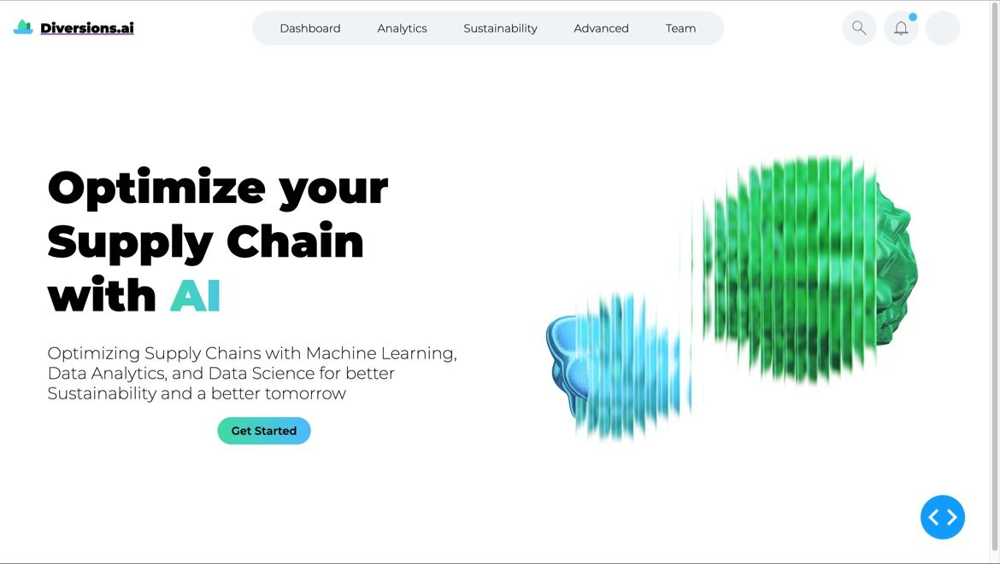

# Vulcanome


Fueling research with dynamic, interactive insights into protein activity.

This project is a Flask-based web service developed as part of my application for the **JetBrains Software Engineering Internship**. It allows users to explore and visualize differences in protein expression levels through an intuitive, interactive interface designed for researchers.

- 🔍 [Learn more about the project](https://heidi-albarazi.vercel.app/jetbrains-internship/gene-knowledge-base-web-service)
- 📄 [View my application and CV](https://heidi-albarazi.vercel.app/)

---
## 📚 Table of Contents

- [📁 Project Structure](#-project-structure)
- [🌐 Endpoint](#-endpoint)
- [📌 Roadmap](#-roadmap)
- [🏆 Hackathon Projects](#-hackathon-projects)
- [✨ Author](#-author)

---
## 🚀 Project Overview

This repository includes:

- 📦 Flask project boilerplate  
- 📂 Structured folders for templates and static files  
- 🧪 A simple `Hello, World!` endpoint to verify the setup  
- 🛠 Python and PyCharm development environment support  

---

## 📁 Project Structure
```
vulcanome/ 
├── app.py # Main Flask app 
├── static/ # Static assets (CSS, JS, etc.) 
├── templates/ # HTML templates 
├── .gitignore # Python & PyCharm-specific ignores 
└── README.md # This file
```
---
## 🧑‍💻 Getting Started

### ✅ Prerequisites

- Python 3.8+
- `pip` installed

### 🛠 Setup

1. Clone the repository:

   ```bash
   git clone https://github.com/wedalb/vulcanome.git
   cd vulcanome
    ```
2. Create and activate a virtual environment:
    ```
    python3 -m venv .venv
    source .venv/bin/activate  # Windows: .venv\Scripts\activate
    ```
3. Install dependencies:
    ```
   pip install Flask
    ```
4. Run the app:
    ```
   python app.py
   ```
5. Open your browser at: http://localhost:5000

---

## 🌐 Endpoint

| Route | Method | Description         |
|-------|--------|---------------------|
| `/`   | GET    | Returns "Hello World!" |

---

## ✨ Author

<p align="center">
  
</p>

<h3 align="center">Heidi Albarazi</h3>

I'm passionate about making complex data accessible through thoughtful design and clean, functional interfaces. My work lives at the intersection of design and development, where I can combine creativity with problem-solving.

I’m especially interested in biology, genetics, and the natural sciences, and I’m working toward a career where I can contribute to research through software. I enjoy building tools that support discovery and insight.

I am a proud hackathon junkie — I’ve participated in 20+ hackathons and won over 10, using them as a space to explore ideas, learn fast, and build things that matter. 

<p align="center">
  <a href="https://github.com/wedalb">
    
  </a>
  <a href="https://www.linkedin.com/in/heidi-a-2a046a165/">
    
  </a>
  <a href="mailto:heidialbarazi2306@gmail.com">
    
  </a>
  <a href="https://heidi-albarazi.vercel.app/">
    
  </a>
</p>

---

### 🏆 Hackathon Projects related to this internship
I have had a lot of experience with flask and plotly and have used dash to build beautiful websites to display my plotly charts. 

#### 🥈 Concast — Cassini Hackathon 2nd Place  
Estimating real-time population using satellite imagery.
<a href="https://github.com/wedalb/cassinihack-frontend">👉 View Repository</a>

<p align="center">
  
  
</p>

---

#### 🌿 Diversion.ai — GreenHack 2nd Place  
AI-powered dashboard to analyze and optimize supply chains:  
<a href="https://www.linkedin.com/posts/activity-7175516286897025024-fo0N?utm_source=share&utm_medium=member_desktop&rcm=ACoAACdmqxgB6gxC8ia8f3YXJ6OUnvhbiaixe9E">👉 View on LinkedIn</a>

<p align="center">
  
  
  
</p>

---


